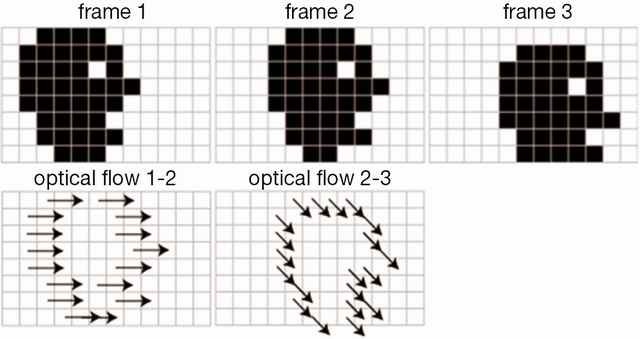
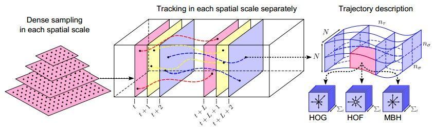
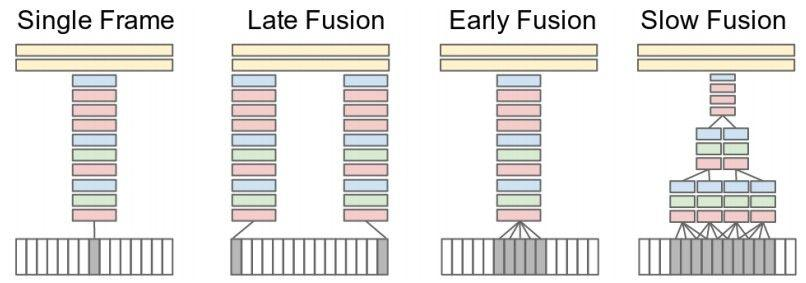
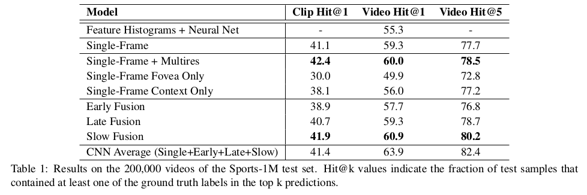
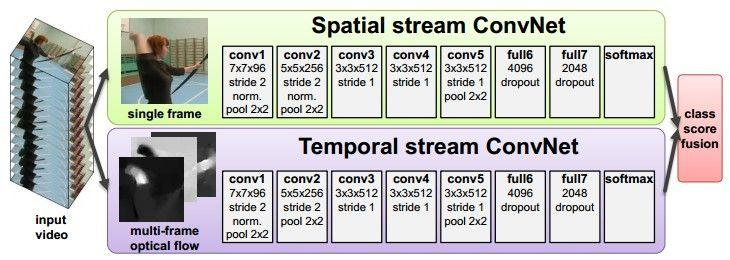
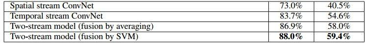
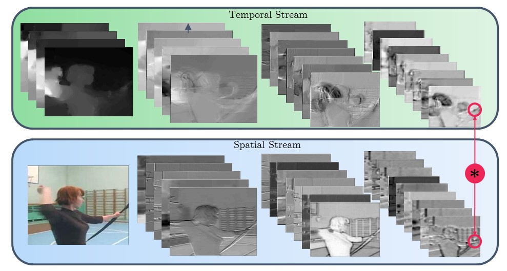
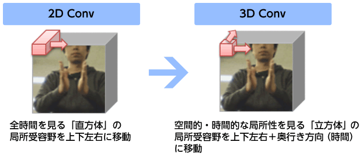
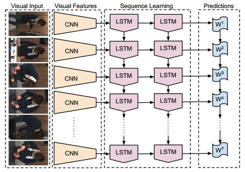

<!-- slide -->
# Action Recognition Overview
小组成员：景晨 谢英杰 吴思远

<!-- slide -->
# Definition
Activity recognition aims to recognize the **actions** and goals of one or more **agents** from a series of observations on the agents' **actions and the environmental conditions**.
- Spatial information (image)
- Temporal information (motion)

<!-- slide -->
# Optical flow
``
$$I(x, y, t) = I(x + \Delta x, y + \Delta y, t + \Delta t)$$

<!-- slide -->
# Traditional method
Dense trajectories and motion boundary descriptors for action recognition (Wang et al., 2013)

<!-- slide -->
# Spatio-Temporal ConvNets
1. Large-scale Video Classification with Convolutional Neural Networks, Karpathy et al., 2014

<!-- slide -->

Note: The motion information didn’t add all that much...

<!-- slide -->
2. Two-Stream Convolutional Networks for Action Recognition in Videos, Simonyan and Zisserman 2014

<!-- slide -->

- 利用光流显著提升精度。
- 利用pretrained model的特征提取的优势。
- Two-Stream 显然比之前的效果要好很多。

<!-- slide -->
3. Learning Spatiotemporal Features with 3D Convolutional Networks, Tran 2015

- 实验经验得到 3x3x3 kernel 效果最好。
- 卷积核的时间维度的长度也只有3，是否获得运动信息呢？
- 缺点: 无法使用预训练好的2维卷积网络。

<!-- slide -->
4. Long-term Recurrent Convolutional Networks for Visual Recognition and Description, Donahue et al., 2015

- CNN -> feature -> RNN(LSTM)
- 获得长期序列信息。
- 模型更复杂，需要先后训练两个模型。
- 实验表明3层LSTM网络效果最好。

<!-- slide -->
# Problems
- 无法完全利用卷积神经网络学习长期的视频信息。
- 视频数据集样本量不够大，容易过拟合，但是数据集总体体积大。
- 大部分的模型还需要依赖光流的帮助。

<!-- slide -->
# Expectation
- 视频相邻帧存在大量的冗余，希望能降低计算复杂度，提高效果。
- 随着硬件（特别是GPU）的发展，在不久的将来，可以有像现在这样的图片数据集（Imagenet），训练时间也可以接受。
- 视频蕴含着比图片多很多的信息。
- 相比于图片，视频具有某种序列，可以用在无监督式学习中的监督因素。
