<!-- slide -->
## Introduce three generative models from the view of video prediction.
 

1631722 吴思远

<!-- slide -->
#### Why generative models should be applied in video prediction?
Uncertainty in video prediction.
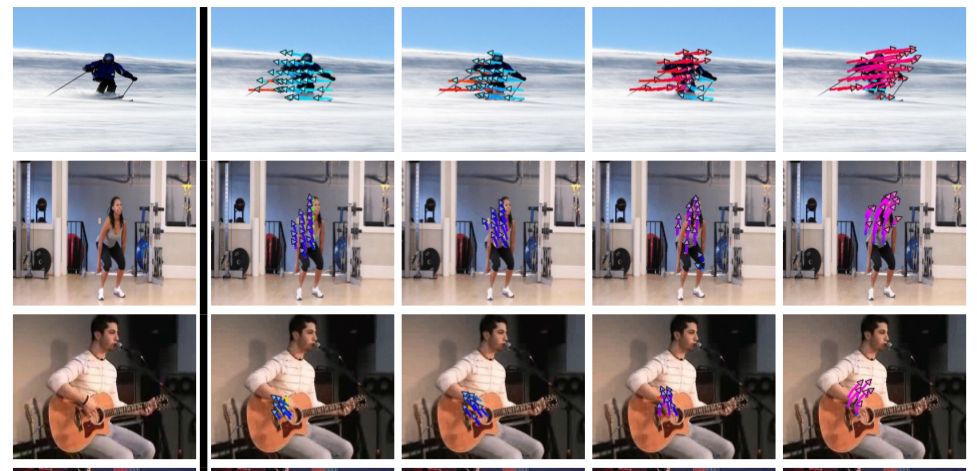

<!-- slide -->
### Generative models
Discriminative Models $\longrightarrow p(\mathbf{y} | \mathbf{x})$

Generative Models $\longrightarrow p(\mathbf{y} , \mathbf{x})$ or $p(\mathbf{x})$.
 
<blockquote class="Blockquote--large">

“What I cannot create, I do not understand.”

<cite>—Richard Feynman</cite>
</blockquote>

<!-- slide -->
- ### Generative Adversarial Network.
- ### Variable Autoencoder.
- ### PixelRNN / PixelCNN (Autoregressive Network).

Papers:
- Generating videos with scene dynamics.
- An Uncertain Future: Forecasting from Static Images using Variational Autoencoders.
- Video Pixel Networks.

<!-- slide -->
### GAN generates 32 frames at a time.
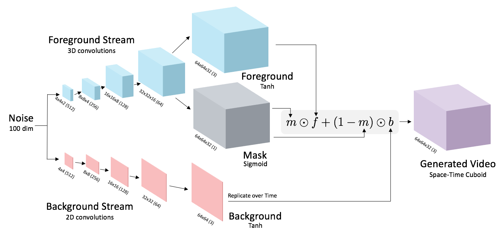

<!-- slide -->
### Selected generated clips
<table>
  <tr>
    <td>Beach</td>
    <td></td>
    <td></td>
    <td></td>
    <td>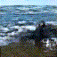</td>
  </tr>
  <tr>
    <td>golf</td>
    <td>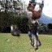</td>
    <td></td>
    <td>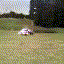</td>
    <td></td>
  </tr>
  <tr>
    <td>train</td>
    <td></td>
    <td></td>
    <td></td>
    <td></td>
  </tr>
  <tr>
    <td>baby</td>
    <td></td>
    <td></td>
    <td></td>
    <td></td>
  </tr>
</table>

<!-- slide -->
### Pros:
- Beautiful, state-of-the-art samples!
### Cons:
- Trickier / more unstable to train.
- Can’t solve inference queries such as p(x), p(z|x).

<!-- slide -->
Different distance metrics used by different models.
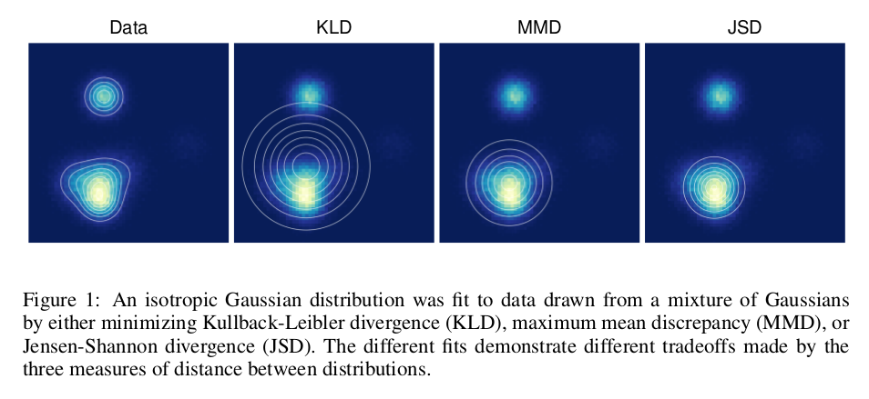
Paper: A NOTE ON THE EVALUATION OF GENERATIVE MODELS.

<!-- slide -->
### Variable Autoencoders
<table>
<tr>
<td>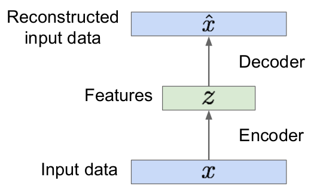</td>
<td>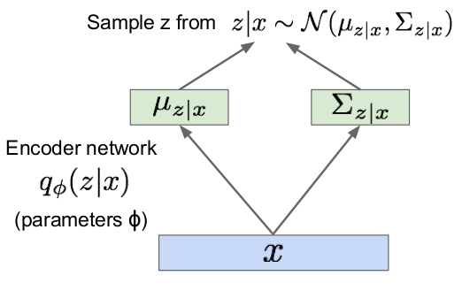</td>
</tr>
</table>

Paper: Auto-Encoding Variational Bayes.

<!-- slide -->
### Maximize lower bound
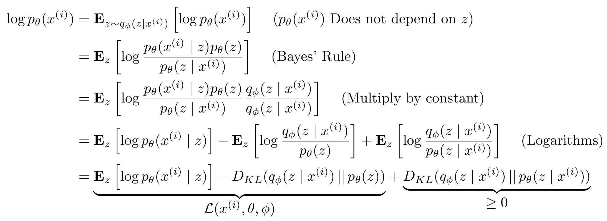
<!-- slide -->
### Reparameterization tricks
$z \sim \mathcal{N}(\mu,\,\Sigma) \longrightarrow
z = \mu + L\varepsilon, \varepsilon \sim \mathcal{N}(0, I)$
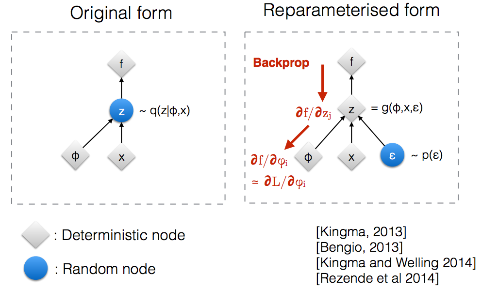

<!-- slide -->
### Predict dense trajectory
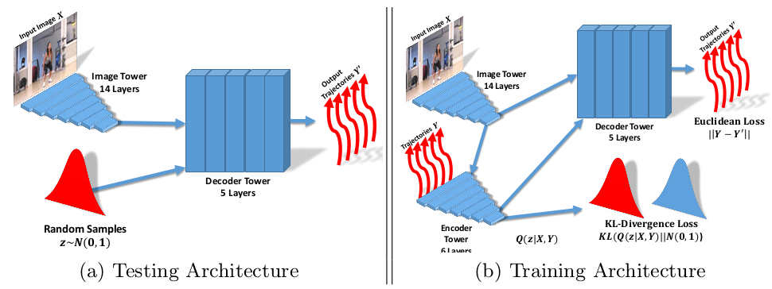

<!-- slide -->
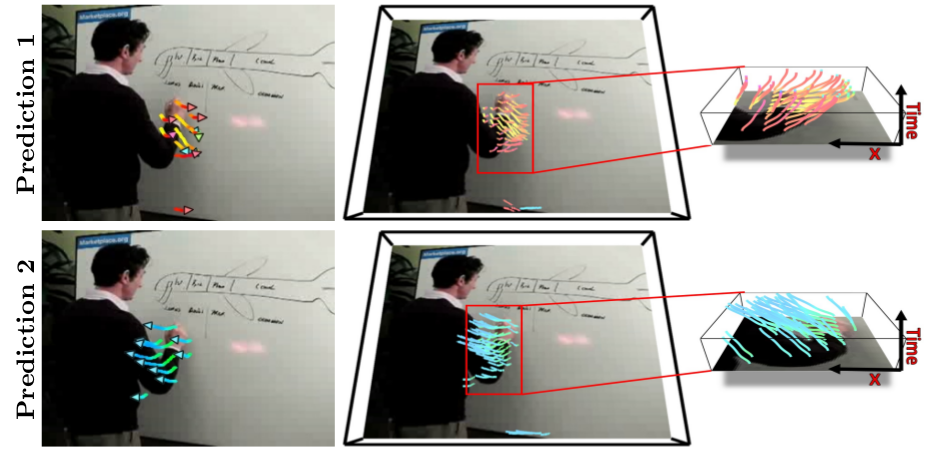

<!-- slide -->
### Pros:
- Principled approach to generative models.
- Allows inference of $q(z|x)$, can be useful feature representation for other tasks.
### Cons:
- Maximizes lower bound of likelihood: okay, but not as good evaluation as PixelRNN/PixelCNN.
- Samples blurrier and lower quality compared to state-of-the-art (GANs).

<!-- slide -->
### Negative log-likelihood for generative models on CIFAR-10 expressed as bits per sub-pixel.
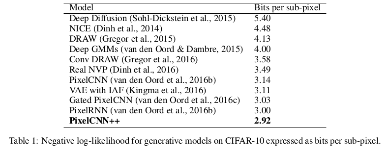

Paper: PIXELCNN++: improving the pixelcnn with discretized logistic mixture likelihood and other modifications.

<!-- slide -->
### PixelRNN / PixelCNN
Basic formula:
$\begin{aligned}
P(X) &= P(x_1,...,x_{i}) \\
&= P(x_i | x_1,..., x_{i-1}) P(x_1,..., x_{i-1}) \\
&= ... \\
&= {\displaystyle \prod_{i=1}^{n^2} P(x_i|x_1,...,x_{i-1})}
\end{aligned}$

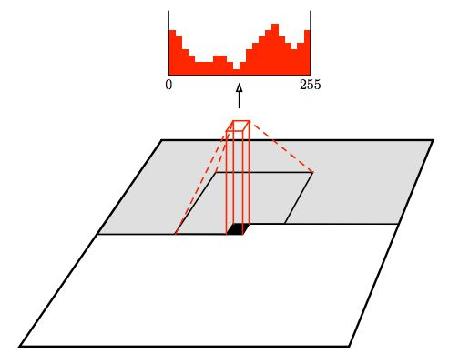

<!-- slide -->
### Results in nats/frame on the Moving MNIST dataset.
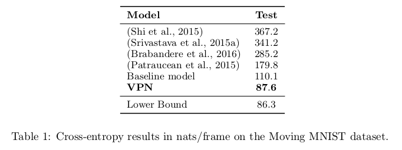
Paper: Video Pixel Networks.

<!-- slide -->
### Pros:
- Can explicitly compute likelihood p(x).
- Explicit likelihood of training data gives good evaluation metric.
- Good samples.
### Con:
- Sequential generation => slow.

<!-- slide -->
## Thank you.
