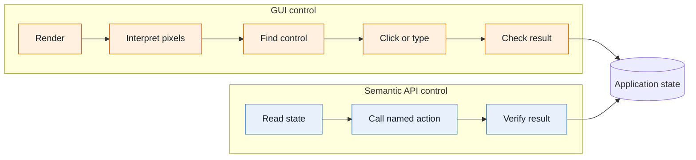
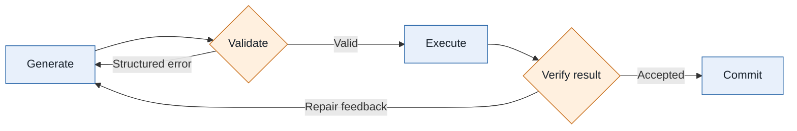

An AI agent can draft an email, summarize a repository, or propose edits. The more difficult question is what happens next: how should it operate an application?

GUI automation and shell access are two practical answers. I use both, but I have also been experimenting with another option: give the agent a small application API and let it write a short JavaScript program for each task.

I call this **API-native computer control**. The name is more ambitious than the current implementation. I do not know whether it is the best general interface for agents, but it seems promising when an application already has structured data, domain rules, and a meaningful API.

## When tool calls become the control loop

Tool calling often exposes actions such as:

```text
create_rectangle(...)
move_object(...)
set_fill_color(...)
delete_object(...)
```

This works well for a few independent actions. It becomes less convenient when a task needs iteration or branching. Imagine a slide editor, canvas, or UI board where the user asks:

> Find every text object smaller than 12 px, increase it to 12 px, and move any overflow into a new text box below the original.

If the model calls one tool for every object, every observation and action may require another inference step. A short program keeps the ordinary computation local:

```js
const objects = canvas.listObjects({ type: "text" });

for (const object of objects) {
  if (object.fontSize >= 12) continue;

  const result = canvas.updateText(object.id, { fontSize: 12 });

  if (result.overflowText) {
    canvas.createText({
      content: result.overflowText,
      x: object.x,
      y: object.y + object.height + 8,
      fontSize: 12,
    });
  }
}
```

The model still chooses the operation, but loops, conditions, and intermediate values do not each need another model turn. Generated code is not a replacement for tools; it is a way to compose approved tools.

## GUI control recovers semantics from pixels

Graphical interfaces are excellent for people. We can scan a canvas, recognize an icon, and point at an object without naming every part of the scene.

For an agent, the same action often takes a longer translation path:



GUI control is indispensable when no structured interface exists. Vision also remains important when appearance is the result, such as editing slides, graphics, or a web page. My concern is using pixels and coordinates as the primary control plane when the application already knows the content, bounds, transform, and identity of each object.

A useful split is to use vision to understand and judge the output, while using semantic operations to change application state when available.

## Why the shell works so well

The shell removes much of the visual interpretation work. It is textual, scriptable, composable, and supported by decades of public examples. Models have seen large amounts of Bash, `git`, `ffmpeg`, and similar tools during training. Some of that operational experience is encoded in the model's learned parameters, so common commands can feel almost native.

That is a substantial advantage:

```sh
ffmpeg -i input.mov -vf "scale=1920:-2,fps=30" -c:v libx264 -crf 20 output.mp4
```

A model familiar with `ffmpeg` may produce this without first studying a manual. The shell is therefore hard to beat for developer environments and established utilities.

The tradeoff is authority and precision. A process launcher plus filesystem access is broader than a narrowly scoped application operation:

```js
video.resize({
  assetId,
  width: 1920,
  frameRate: 30,
  destination: approvedOutput,
});
```

CLI syntax also depends on conventions that are not fully captured by a machine-checkable schema.

Containers and operating-system sandboxes still matter. A narrow API does not replace them, but it can reduce the authority placed inside the boundary. For application-level automation, that may also allow a lighter runtime than a general shell environment.

## From fixed handlers to generated programs

In a React application, a button usually invokes code that a developer prepared in advance:

```tsx
function AlignButton({ selectedIds }) {
  const onClick = () => {
    const objects = selectedIds.map((id) => editor.getObject(id));
    const left = Math.min(...objects.map((object) => object.x));

    for (const object of objects) {
      editor.updateTransform(object.id, { x: left });
    }

    editor.commitHistory("Align left");
  };

  return <button onClick={onClick}>Align left</button>;
}
```

The button is a human-friendly handle for a predefined code path. This is reliable, but fixed: the developer must anticipate the action and prepare the handler beforehand.

An agent can instead generate a short program on the fly from a finite set of lower-level application APIs:

```js
const objects = canvas.getSelection();
const left = Math.min(...objects.map((object) => object.bounds.x));

for (const object of objects) {
  canvas.move(object.id, { x: left, y: object.bounds.y });
}
```

Frequent actions should probably remain buttons. The more flexible case is an operation that was not anticipated as one fixed handler. The application developer defines the finite API vocabulary and its limits; the agent combines those primitives for the current request. The developer does not need to enumerate every useful sequence beforehand.

## How the API-native architecture fits together

Generating a program for each request raises two immediate questions: how does the agent learn the application's API, and how can that generated code run without receiving unrestricted access?

The architecture I am exploring in [`CogCore`](https://github.com/carsonDB/CogCore) answers those questions with an API retrieval path and a guarded execution path:


The application team owns the TypeScript API, product permissions, and final state changes shown in orange. [`CogCore`](https://github.com/carsonDB/CogCore) provides the blue agent and runtime components. A chat agent delegates the task to a code agent. The code agent retrieves only the relevant API manual, writes a short JavaScript program, and sends it to the guarded runtime.

The application developer implements the API in TypeScript. A build step uses [`ts-morph`](https://ts-morph.com/) to extract signatures and type relationships from selected `*.api.ts` entry points into a searchable graph. TypeScript remains the source of truth; the graph becomes the agent's manual.

Generated JavaScript receives named globals chosen by the host application, rather than automatic access to the DOM, shell, network, or application internals:

```ts
class CanvasForAI {
  listObjects(filter?: ObjectFilter): ObjectSummary[];
  getObject(id: string): CanvasObject | null;
  createShape(input: ShapeInput): CanvasObject;
  createText(input: TextInput): CanvasObject;
  updateGeometry(id: string, input: GeometryUpdate): CanvasObject;
  updateAppearance(id: string, input: AppearanceUpdate): CanvasObject;
  removeObjects(ids: string[]): void;
}
```

This is a generic example, not an announcement of a particular editor project.

The finite surface is the important constraint. Generated code can combine these APIs in ways the developer did not predefine, but it should not automatically receive the DOM, shell, network, or internal application state.

## Why JavaScript needs runtime validation

Why generate JavaScript rather than TypeScript? A task program has a short lifecycle: write it, run it, verify it, and discard it. Requiring imports and type annotations adds syntax, while the actual application API is already defined in TypeScript.

More importantly, TypeScript checking would still not be enough. Its types are erased when code becomes JavaScript, and broad static types do not express many runtime rules:

```ts
type UpdateInput = {
  color: string;
  svgPath: string;
  opacity: number;
};
```

All three fields are statically valid, but the application still needs to ask:

```text
color   -> Is it a valid color accepted by this renderer?
svgPath -> Is it valid SVG path data within a complexity limit?
opacity -> Is it finite and between 0 and 1?
```

For this reason, [`CogCore`](https://github.com/carsonDB/CogCore) starts with plain JavaScript and adds checks at the boundary. JavaScript `Proxy` wrappers restrict access to the declared object surface and reject unknown properties. Zod schemas validate arguments and results against application rules. A worker adds separation and timeouts, although it is not equivalent to a VM, container, or operating-system sandbox.

The goal is not to make generated code automatically correct. It is to make failures constrained and repairable:



API design carries much of the safety model. Compare a broad shell capability:

```js
system.exec(command);
```

with a narrow application capability:

```js
project.deleteGeneratedPreview({ previewId });
```

The first delegates meaning to a shell with ambient authority. The second can validate an opaque identifier, check ownership, record history, and support undo. The narrower operation is safer and easier for the model to use correctly.

## The central limitation of API-native control

API-native control offers semantic operations, narrow permissions, strong multi-step composition, and the possibility of a lightweight application sandbox. Its central weakness is not execution power but unfamiliarity.

The same training advantage that helps shell agents exposes this weakness. Models have seen enormous amounts of shell code, so common shell skills are already encoded in their learned parameters. After training, those parameters remain fixed until the model is updated or fine-tuned. A larger model may reason better from context, but size alone does not give it native experience with a newly created application API.

A manual can supply current information at inference time, yet models do not always use it reliably. They may ignore part of it, invent a familiar-sounding method, or fall back to stale patterns learned during training. Retrieval and repair help, but they also add latency.

Compared with API-native control, GUI automation has greater reach because it can operate software that exposes no structured API, but it pays for that reach by recovering semantics from pixels. Shell control has much stronger model familiarity and an excellent ecosystem, but it often exposes broader authority and fits structured application state less precisely. Individual tool calls retain narrow schemas, but long tasks can turn the model itself into the control loop.

API-native control is trying to keep the useful properties together: semantic access, finite authority, local program composition, and adaptation through an updated manual. The unresolved part is that an updated manual is not the same as an internalized skill.

This is why external skills matter. Instead of placing every operational skill permanently in model weights, an agent system could retain concise lessons from accepted runs and revise them as the application changes. [`CogCore`](https://github.com/carsonDB/CogCore) includes an early experiment with reusable skill tips, but this is not a solved learning system.

The open problem is not only how to expose a safer interface. It is how to make an agent reliably adapt to an interface it has never seen before, without letting old habits override the application's current rules. Until that works consistently, API-native control remains a useful direction with a very real limit.
